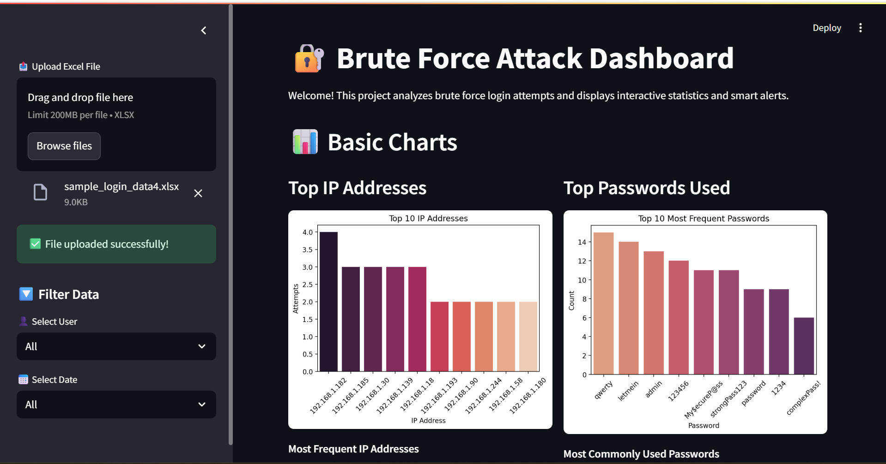

# 🔐 Brute Force Attack Dashboard

This is a simple interactive dashboard built with **Streamlit** that analyzes brute force login attempts and visualizes important statistics, alerts, and patterns.

---

## 📊 Features

- Upload and analyze Excel login data
- Filter by user and date
- View top IP addresses and commonly used passwords
- Detect suspicious activity and failed login attempts
- Visualize weak password usage
- Time-based attack patterns (by hour and day)
- Export filtered data as Excel

---

## 🚀 How to Run

1. **Clone this repo**:

```bash
git clone https://github.com/ManalBafraj/brute-force-dashboard.git
cd brute-force-dashboard


```
2. **Install dependencies**:

```bash
pip install -r requirements.txt


```
3. **Run the app**:
```bash
streamlit run dashboard.py


```
📤 **4.Upload Format**
```bash
Make sure your Excel file contains at least the following columns:

- `timestamp`
- `username`
- `foreign_ip`
- `passwords`
- `status`
- `used_weak_password` (optional)
- `country` (optional)


```
🌐5.** Live Demo**:
```bash
Try it online here 👉 Streamlit Cloud Link (Replace with actual link if hosted)


```
📸 6.**Screenshots**:
```bash
### 📸 Screenshots




 
 


```
🛠️ 7.**Built With**:
```bash
Streamlit

Pandas

Matplotlib

Seaborn


```
🙋‍♀️ 8.**About Me**:
```bash
Hi, I'm Manal Bafaraj! I'm currently learning about AI and cybersecurity through hands-on projects.
This dashboard is one of my first end-to-end projects in analyzing login threats using real data.
Feel free to connect on LinkedIn or share feedback 💬


